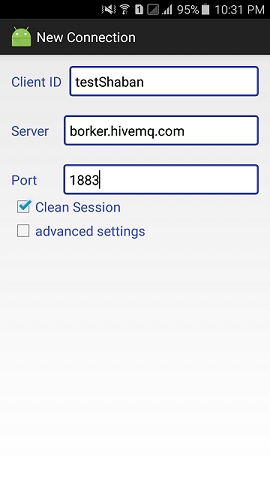
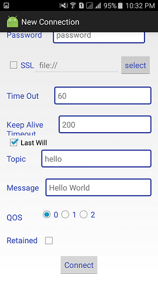

# Project Title

Eclipse paho MQTT sample project.

## Getting Started Installing

1. Download the code `git clone https://github.com/shabansheta19/MQTTapp.git`.
2. import the project into Android Studio.
3. Build and run it.

## tests screenshots

      

      

      

  
